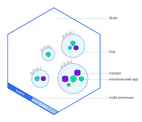

# Kubernetes Scheduling - Assinging pods to nodes  Jonathan Beckford  sp20-516-237

:o2: rejected is not proper markdown and breakes book creation

:o2: whatever editor you are using it is not doing a good job. your document includes the attempt to graohically mace distinctions instead of ysing proper pparagrahs. however if it renders with pandoc, it may be ok. you can test this yourself.

:o2: your overuse of itemized lists makes the document difficult to maintain. why not say 

*Step 1*: doing this and that

```bash
$ multipass ....
...
```

This will result in ....

```
here is my output
```


* Jonathan Beckford
* [sp20-516-237](https://github.com/cloudmesh-community/sp20-516-237)
* [report](https://github.com/cloudmesh-community/sp20-516-237/blob/master/chapter/k8-scheduling-pods.md)

## Introduction

A container is an abstraction that in a nutshell represents the local
environment where an application will execute.  It is very similar to a
physical server or VM but unique in that it does not represent actual
infrastructure but rather an abstraction of said infrastructure.  This
allows you to decouple your application needs from your infrastructure
needs.  This local environment has everything an app needs to run such
as programming language packages for example.  Once in a container the
application is portable to any infrastructure that can host it.  Kubernetes
at a high level is an orchestrator that allows you to place your container
on a given piece of infrastructure. It does this by first placing the
container in a pod and then deploying that pod to a physical or virtual node
(server).  Therefore, pods in Kubernetes are a packaged unit of work that
are in a runnable or executable state.  They represent the smallest unit of
work in Kubernetes that can be created or deployed.  A pod includes inside
of it one or more containers.  Kubernetes supports several different
container runtimes but Docker is the most commonly used [@kubernetes_pods2020
-sp20-516-237].  There is a one
to many relationship between pods and containers.  Meaning that you can
design your app to run across several containers within the same pod or you
can stick to one container in one pod, it's up to the developer.  See Fig 1
for a more detailed view of a pod.

:o2: image includsin wrong, if copied, citation is missing Fig 1 wrong, please see notation.md for proper citation
empty lines in document missing 


TODO: check to see if figure is correctly referenced in Bibtex format

:o2: punctuation wrong

So how does Kubernetes determine how to assign a pod, it's smallest unit of
work, to a given node?  The main way is through the Kubernetes Scheduler
.  The Scheduler is responsible for identifying pods with no assigned pod and
then assigning those pods to a particular node to run on.  The scheduler uses
certain principles to make it's decision of where to assign pods.  These
principles and other scheduler details are described in the subsequent
section.

## Assigning Pods to Nodes - kube-scheduler

:o2: indentation messed up. please learn markdown

Pods can be assigned to specific nodes by administrators or deployment
 engineers but that means a lot of manual work to avoid unhealthy nodes or
 nodes with inadequate resources [@Goltsman2019-sp20-516-237].  That is where
  the scheduler comes in
 to play.  The scheduler in Kubernetes is called "kube-scheduler".  Kube
 -scheduler performs a 2 step operation when determining how to assign pods
 : Filtering and Scoring [@kubernetes_scheduler2020-sp20-516-237].
 
 1. Filtering - a node list is created in this step.  Any available node that
  matches what is being requested by the pod is added to this list. There are a
   number of default policies that kube-scheduler takes into account when
   determining if a node is a match. A couple examples of
     these below [@kubernetes_scheduler2020-sp20-516-237].  
    * > PodFitsResources - Checks if the Node has free resources (eg, CPU and
     Memory) to meet the requirement of the Pod
    * > NoVolumeZoneConflict - Evaluate if the Volumes that a Pod requests are
     available on the Node, given the failure zone restrictions for that
      storage 

 2. Scoring - Using the node list generated from the filtering step, kube
 -scheduler scores the nodes based on whatever active scoring rules are in
  place.  Kube-scheduler assigns the pod to the node with the highest score
  .  In the event of a tie a winner is chosen at random.  Some examples of
   scoring rules below [@kubernetes_scheduler2020-sp20-516-237]:
    * > SelectorSpreadPriority - Spreads Pods across hosts, considering Pods
      > that belong to the same Service, StatefulSet or ReplicaSet.
    * > NodeAffinityPriority - Prioritizes nodes according to node affinity
      > scheduling preferences indicated in
      > PreferredDuringSchedulingIgnoredDuringExecution.
  
 
 NOTE: For a full list of these policies see [here](https://kubernetes.io/docs/concepts/scheduling/kube-scheduler/)
  
## Assigning Pods to Nodes - pod configuration

A pod can be assigned to a node either via the scheduler or can be
 manually directed to a node via the nodeName field in the pod config file
 .  Using
  nodeName is the simplest form of selecting a node but is very limited and
   thus rarely used [@kubernetes_assignpod2020-sp20-516-237].  The nodeName
    field is used to list the exact node
    the pod should be executed on and it takes precedence above other node
     selection rules [@kubernetes_assignpod2020-sp20-516-237].  Given the limited nature of using nodeName the
      remaining sections focus on node selection constraints that integrate
       with the scheduler.
       
Node selection constraints that integrate with the scheduler can be placed
 into 3 categories or types: nodeSelector, node affinity, and taints/tolerations.
 
   ### nodeSelector
 
   This is the earliest feature Kubernetes used to allow developers or admins
    to assign pods to specific nodes [@Goltsman2019-sp20-516-237].  It makes use of key/value pair
     labels to do this.  The key/value pair label must first be tagged to the
      node (see example below).
   
    kubectl label nodes workernode1 preferred=true
   
   That same key/value pair label must then be added to your pod
    configuration (see example below).
   
     spec:
       containers:
       - name: <app name>
         image: <image name>
         imagePullPolicy: Always
         ports:
         - containerPort: <port number>
       nodeSelector:
         preferred: "true"
    
  With these two pre-requisites in place the scheduler will now be able to
   assign any requested pod with this label to the appropriate node.  
 
   ### Node Affinity
 
   The use of node affinity is a much more sophisticated
    way of pairing pods to nodes but it works in a similar fashion to
     nodeSelector.  Key/value label pairs are still used on pod and node but
      the 3
      key
      differences to
      nodeSelector per
      Kubernetes [@kubernetes_assignpod2020-sp20-516-237] are as follows:
   
   1. More options are provided in the language than simply "exact match
   " comparison and the use of "AND".  You can do comparisons such as "In
   ", "NotIn", "Gt" (greater than), and others. Example below:
   
   2. The label rule can be identified as being optional or a "soft
    preference".  Meaning that if the rule is not satisfied but the scheduler
     still finds this to be the best node to run on, the pod will still be
      scheduled on that node. Example below:  
      
   3. Inter-pod affinity is possible which allows for these label rules to be
    applied based on pods already running on a node.  Meaning, if my pod
     starts up
    , the
     scheduler will determine if actively running pods on a given node can
      run with my pod based on these label rules matching or not matching
       between new pod and existing pods.
 
   ##### Node affinity example:
    
  The goal is to have a pod scheduled on a rhel (os-type) node as a must AND
    preferrably on a node with disk-type of ssd.  In the below example, a pod
     would normally get scheduled on workernode3 given the pod configuration.
   
   Applying node label:
       
    kubectl label nodes workernode1 os-type=windows
    kubectl label nodes workernode1 disk-type=ssd
    kubectl label nodes workernode2 os-type=rhel
    kubectl label nodes workernode2 disk-type=ssd
    kubectl label nodes workernode3 os-type=rhel
    kubectl label nodes workernode3 disk-type=hdd
         
   Pod configuration:
       
    spec:
      affinity:
        nodeAffinity:
          requiredDuringSchedulingIgnoredDuringExecution:
            nodeSelectorTerms:
            - matchExpressions:
              - key: os-type
                operator: In
                values:
                - "rhel"
          preferredDuringSchedulingIgnoredDuringExecution:
          - weight: 1
            preference:
              matchExpressions:
              - key: disk-type
                operator: In
                values:
                - "ssd" 
 
   ##### Inter-pod affinity example:
   
   Inter-pod affinity and anti-affinity are more powerful than node affinity
    because it allows you to create node selection rules based on pods that
     are already running on nodes.  However, because it requires a
      significantly higher amount of processing it can slow down scheduling
       and so per Kubernetes [@kubernetes_assignpod2020-sp20-516-237] it is not recommended on clusters larger
        than few hundred nodes.  Note that anti-affinity refers to the
         ability to define labels which your pod will avoid.
   
   In the example below taken from Kubernetes site [@kubernetes_assignpod2020-sp20-516-237] there is one pod affinity
    rule (required) and another
    anti-affinity rule (preferred) defined.  The goal of affinity rule is to
     only schedule this pod on a node that has the listed topologyKey (failure
     -domain
    .beta.kubernetes.io/zone) AND has a pod running on it with key/value pair
    : security=S1.  The goal of the anti-affinity rule is to preferrably
     AVOID scheduling this pod on a node that has the listed topologyKey
      (failure
     -domain
     .beta.kubernetes.io/zone) AND has a pod running on it with key/value pair
    : security=S2.
        
   Pod configuration:
       
    spec:
      affinity:
        podAffinity:
          requiredDuringSchedulingIgnoredDuringExecution:
          - labelSelector:
              matchExpressions:
              - key: security
                operator: In
                values:
                - S1
            topologyKey: failure-domain.beta.kubernetes.io/zone
        podAntiAffinity:
          preferredDuringSchedulingIgnoredDuringExecution:
          - weight: 100
            podAffinityTerm:
              labelSelector:
                matchExpressions:
                - key: security
                  operator: In
                  values:
                  - S2
              topologyKey: failure-domain.beta.kubernetes.io/zone 
  
  ### Taints and Tolerations
  
  The use of Taints and Tolerations is a similar use case as the one behind
   pod anti-affinity rules.  Per Kubernetes [@kubernetes_taints2020-sp20-516
   -237] node affinity in general is
    meant to be used for
    the use case of "attracting" a pod to a particular node but taints
    /tolerations are used for the opposite which is to repel pods from nodes.
    
  Taints and tolerations are the two components used to repel pods from nodes
  .  Taints define a rule on a node and tolerations on a pod determine
   whether that pod can "tolerate" the node taint.  If it can then pod will
    run on that node.
  * Taints are applied to nodes similar to the key/value pair labels in node
   affinity. One difference is the use of the effect tag.  This effect tag
    can be one of NoSchedule, PreferNoSchedule, and NoExecute.  The two
     schedule effects are taken into account during scheduling whereas the
      execute effect applies to already running pods on the node.  So if a
       NoExecute effect is applied to a node and a running pod matches the
        taint key/value pair then it will be evicted from the node.  See
         example below:
   
        kubectl taint nodes workernode1 key=value:NoSchedule
    
   * Tolerations are part of the pod configuration.  If the toleration for
    the pod matches the taint rule for the node then the pod can run on that
     node.  Example below:
     
         tolerations:
         - key: "key"
           operator: "Equal"
           value: "value"
           effect: "NoSchedule"
  
## DEMO

The below details cover, first, how to setup a small kubernetes cluster on your
 laptop using Microk8s.  Second, how to setup small flask app in a docker image
  and deploy it to kubernetes cluster.  Third, how to configure nodeSelector
   rules and node affinity rules to show case how pod assignment works at a
    high level.  This demo was run on a Windows 10 EDU laptop.  If you are
     running on a different OS the instructions will be slightly different.
    
### Setup of Microk8s cluster

1. Log into power shell as admin
 
2. Create 1 master node

        multipass launch --name microk8s-vm --mem 2G --disk 30G

3. Create 3 worker instances:
            
       multipass launch --name microk8s-vm-w1 --mem 2G --disk 20G
       multipass launch --name microk8s-vm-w2 --mem 1G --disk 20G
       multipass launch --name microk8s-vm-w3 --mem 1G --disk 20G
     
4. Run the following for each instance (master node and each worker node):
        
       multipass shell microk8s-vm
       sudo snap install microk8s --classic
       sudo microk8s.status --wait-ready
           (the above should return a status of running for microk8s)
       sudo usermod -a -G microk8s $USER
           (the above will add your default user when you log into vm shell
            to the microk8s group so that sudo is no longer required)
       echo "alias kubectl='microk8s.kubectl'" >> ~/.bash_aliases  
           (the above will allow you execute kubectl commands directly
            without microk8s qualifier)
       exit out of shell
       multipass shell microk8s-vm
            (the above will relogin to shell for all settings to take hold)
        
5. Configure cluster (must be done on master node)
        
       multipass shell microk8s-vm
       microk8s.add-node
           (the above will generate the join command you need to execute on
            each worker instance.  The join command is unique for each
             worker instance so execute 3 times in this case)
       login to each worker and execute the respective join command from
        above. Example:
           microk8s.join 192.168.200.238:25000/fQrUWjuDKsEkHLxAxXsftjeuAYItUvLF
       kubectl get nodes
            (the above will list all of the nodes that are now part of your
             cluster)
             
### Setup of Flask app

1. Login to shell on master vm/instance
        
        multipass shell microk8s-vm
        
2. Create working directory

        mkdir flask_web
        cd flask_web
        
3. Create new file for flask app code

        vi app.py
        
4. Insert the following code into app.py
        
        # flask_web/app.py
        from flask import Flask
        app = Flask(__name__)

        @app.route('/')
        def hello_world():
            return 'Hello! We have Flask running in a Docker container!'

        if __name__ == '__main__':
            app.run(debug=True, host='0.0.0.0')

5. Create new file for python package/module dependencies 

        vi requirements.txt
        
6. Insert the following into requirements.txt:
        
        Flask==0.10.1
        
7. Create new file called Dockerfile to define docker image build details

        vi Dockerfile
        
8. Insert the following into the Dockerfile (replace "Your Name" with your
 name):
        
        FROM python:3.8
        
        MAINTAINER "Your Name"
        
        RUN mkdir /app
        
        WORKDIR /app
        
        COPY . /app
        
        RUN pip install -r requirements.txt
        
        ENTRYPOINT [ "python" ]
        
        CMD [ "app.py" ]
        
9.  Install docker on master node
        
        sudo snap install docker
        
10. Login to docker hub (requires you to create docker hub account: <https
://hub.docker.com/>)

        sudo docker login
        
11. Build docker image (make sure you are in flask_web directory where
 Dockerfile exists and replace <your docker
 user id> with your docker hub user id)

        sudo docker build . -t <your docker user id>/test-image:public
        
12. Push your image to docker hub (replace <your docker
 user id> with your docker hub user id)
    
        sudo docker push <your docker user id>/test-image:public
        
13. Create basic deployment yaml file

        vi deployment.yaml
        
14. Insert the following into the deployment yaml file (replace <your docker
 user id> with your docker hub user id):

        apiVersion: apps/v1
        kind: Deployment
        metadata:
          name: mytest-deployment
          labels:
            app: test-app
        spec:
          selector:
            matchLabels:
              app: test-app
          replicas: 1
          template:
            metadata:
              labels:
                app: test-app
            spec:
              containers:
              - name: test-app
                image: <your docker user id>/test-image:public
                imagePullPolicy: Always
                ports:
                - containerPort: 5000
        ---
        apiVersion: v1
        kind: Service
        metadata:
          name: mytest-service
          labels:
            run: test-app
        spec:
          ports:
          - port: 8080
            targetPort: 5000
            protocol: TCP
            name: http
          selector:
            run: test-app
 
15. Deploy image as Docker container to kubernetes cluster
 
        kubectl apply -f deployment.yaml
        
16. Use below commands to check on your deployment.  The "get" command will list
 the pod you just deployed
  and it's status.  Wait until it shows as "running".  The "describe" command
   will give you detailed information and any errors that might have occurred
   .  Notice that either one of these will also tell you what node the pod
    was scheduled to run on.  In this case the scheduler is using default
     rules to decide.
 
        kubectl get pods
        kubectl describe pods
        
### Demo node selection rules -- nodeSelector

1. List out nodes and their existing labels:
        
        kubectl get nodes --show-labels   
        
2. Add a custom label to one of the nodes in your cluster:

        kubectl label nodes microk8s-vm-w1 preferred=true
        
3. List out all node labels again to validate your changes

        kubectl get nodes --show-labels   
        
4. Create nodeSelector deployment yaml file in flask_web directory

        vi deployment_nodeselector.yaml
        
5. Insert the following into the deployment yaml file (replace <your docker
 user id> with your docker hub user id):

        apiVersion: apps/v1
        kind: Deployment
        metadata:
          name: mytest-deployment-ns
          labels:
            app: test-app-ns
        spec:
          selector:
            matchLabels:
              app: test-app-ns
          replicas: 1
          template:
            metadata:
              labels:
                app: test-app-ns
            spec:
              containers:
              - name: test-app-ns
                image: <your docker user id>/test-image:public
                imagePullPolicy: Always
                ports:
                - containerPort: 5001
              nodeSelector:
                preferred: "true"
        ---
        apiVersion: v1
        kind: Service
        metadata:
          name: mytest-service-ns
          labels:
            run: test-app-ns
        spec:
          ports:
          - port: 8080
            targetPort: 5001
            protocol: TCP
            name: http
          selector:
            run: test-app-ns 
 
6. Deploy image as Docker container to kubernetes cluster
 
        kubectl apply -f deployment_nodeselector.yaml
        
7. Use below commands to check on your deployment.  If you have previously
 deployed pods, this pod name should have "mytest-deployment-ns" as a prefix
 .  The
  "get" command
  will list
 the pod you just deployed
  and it's status.  Wait until it shows as "running".  The "describe" command
   will give you detailed information and any errors that might have occurred
   .  Notice that either one of these will also tell you what node the pod
    was scheduled to run on which should have been worker node "1".
 
        kubectl get pods
        kubectl describe pods

### Demo node selection rules -- Node Affinity

1. List out nodes and their existing labels:
        
        kubectl get nodes --show-labels   
        
2. Add a custom label to three of the nodes in your cluster:

        kubectl label nodes microk8s-vm-w1 disk_size=1
        kubectl label nodes microk8s-vm-w1 disktype=hdd
        kubectl label nodes microk8s-vm-w2 disk_size=2
        kubectl label nodes microk8s-vm-w2 disktype=hdd
        kubectl label nodes microk8s-vm-w3 disk_size=2
        kubectl label nodes microk8s-vm-w3 disktype=ssd
        
3. List out all node labels again to validate your changes

        kubectl get nodes --show-labels   
        
4. Create nodeSelector deployment yaml file in flask_web directory

        vi deployment_nodeaffinity.yaml
        
5. Insert the following into the deployment yaml file (replace <your docker
 user id> with your docker hub user id):

        apiVersion: apps/v1
        kind: Deployment
        metadata:
          name: mytest-deployment-na
          labels:
            app: test-app-na
        spec:
          selector:
            matchLabels:
              app: test-app-na
          replicas: 1
          template:
            metadata:
              labels:
                app: test-app-na
            spec:
              containers:
              - name: test-app-na
                image: <your docker user id>/test-image:public
                imagePullPolicy: Always
                ports:
                - containerPort: 5002
              affinity:
                nodeAffinity:
                  requiredDuringSchedulingIgnoredDuringExecution:
                    nodeSelectorTerms:
                    - matchExpressions:
                      - key: disk_size
                        operator: Gt
                        values:
                        - "1"
                      - key: disktype
                        operator: NotIn
                        values:
                        - "hdd"
        ---
        apiVersion: v1
        kind: Service
        metadata:
          name: mytest-service-na
          labels:
            run: test-app-na
        spec:
          ports:
          - port: 8080
            targetPort: 5002
            protocol: TCP
            name: http
          selector:
            run: test-app-na
 
6. Deploy image as Docker container to kubernetes cluster
 
        kubectl apply -f deployment_nodeaffinity.yaml
        
7. Use below commands to check on your deployment.  If you have previously
 deployed pods, this pod name should have "mytest-deployment-na" as a prefix
 .  The
  "get" command
  will list
 the pod you just deployed
  and it's status.  Wait until it shows as "running".  The "describe" command
   will give you detailed information and any errors that might have occurred
   .  Notice that either one of these will also tell you what node the pod
    was scheduled to run on which should have been worker node "3".
 
        kubectl get pods
        kubectl describe pods


## Professor Notes

:o2: I have no longer an idea what this means? This document does not exist

Please work with:

<https://github.com/cloudmesh-community/sp20-516-231/blob/master/chapter/report.md>

:o2: revise ttle if needed 

Default scheduler but showcasing some of the more interesting criteria for routing pods to nodes
  
